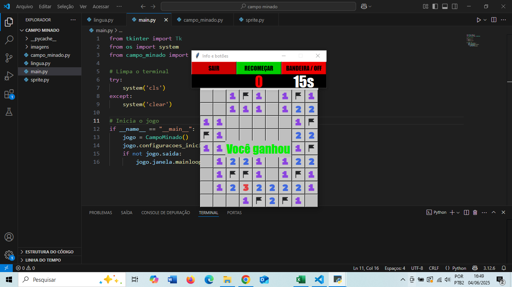
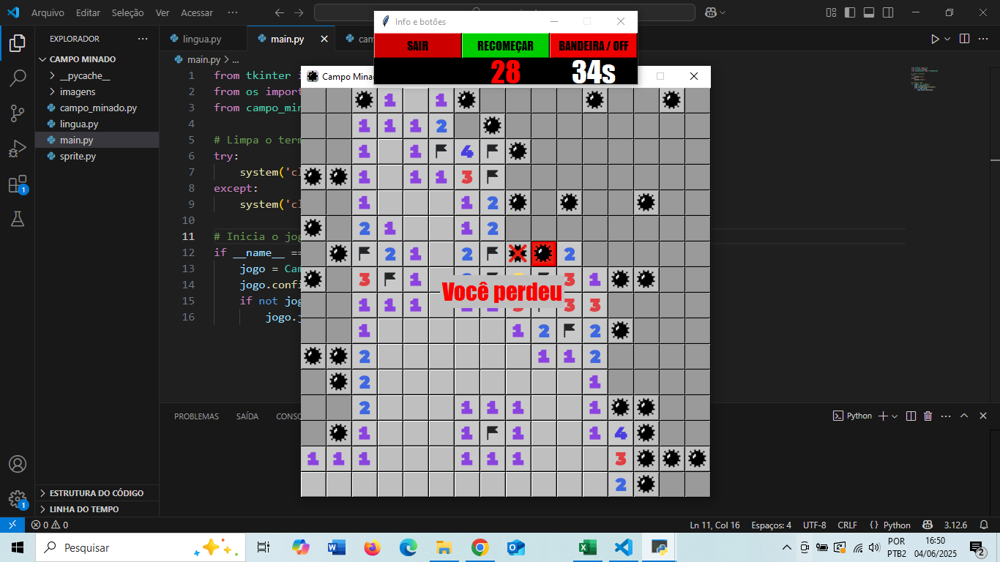

# Campo Minado - Jogo em Python

Jogo clássico de **Campo Minado** desenvolvido em Python com interface gráfica usando **tkinter**.

---

## Idiomas

O jogo suporta três idiomas:  
- Português  
- Espanhol  
- Inglês  

Você pode escolher o idioma para jogar conforme sua preferência.

---

## Dificuldades

O jogo oferece três níveis de dificuldade:  
- Fácil  
- Médio  
- Difícil  

Cada nível altera o tamanho do campo e a quantidade de minas.

---

## Como jogar

1. Abra o arquivo `main.py` (ou o arquivo principal do projeto).  
2. Escolha o idioma e o nível de dificuldade.  
3. Clique nas células para abrir e evitar as minas.  
4. O objetivo é abrir todas as células sem minas.

---

## Imagens da interface do jogo

<table>
  <tr>
    <td></td>
    <td></td>
  </tr>
</table>
